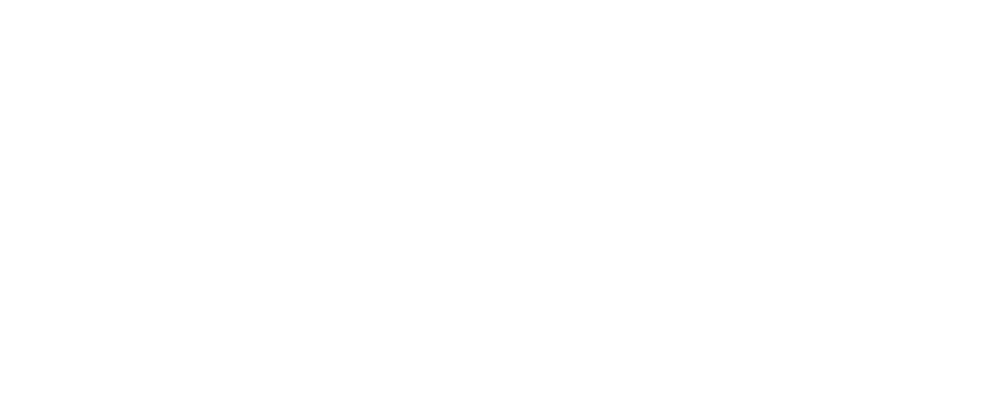

<div align="center">
  
</div>

# G.L.O.W. (Geometric Light Oscillation Workstation)

[](https://www.gnu.org/licenses/gpl-3.0)


[](https://standardjs.com)

A generative visual playground for sound-reactive geometry. 

**Live Demo**: [glow.luminode.studio](https://glow.luminode.studio/)  
**Demos & Showcase**: [YouTube Playlist](https://www.youtube.com/playlist?list=PLPLNsAMGizPvOxgBN0TJDBIRIPvcY6njN)

## What is a Luminode?

A **luminode** is a visual pattern module. Think of it as an oscillator in a synthesizer. The core drawing component that generates geometric shapes and patterns. Each luminode is a self-contained visual effect that responds to MIDI input, creating structured geometries inspired by computer and kinetic art pioneers like Jesús Rafael Soto, Gego, John Whitney, and Thomas Wilfred.

## Features

- **Luminodes** - Modular visual pattern system with 20+ geometric patterns (Lissajous curves, spheres, grids, and more)
- **Rendering Pipeline** - Multi-stage visual processing with post-processing effects ([see diagram](diagrams/04-rendering-pipeline.md))
- **Track-Based System** - Multi-track luminode management with independent instances
- **Trajectory Motion System** - Whitney-style motion patterns for spatial animation ([see docs](diagrams/03-track-system.md))
- **Modulation System** - LFO-style parameter modulation for dynamic visual evolution
- **Canvas Filters** - Lumia blur, invert, grid overlay, CRT effect, noise overlay, dither, chromatic aberration
- **MIDI Mappings** - Custom hardware controller mappings (see `midi-mappings/`)
- **Experimental HID Canvas (Deprecated)** - Drawing tablet support for interactive control

## Quick Start

```bash
python3 -m http.server 8000
```

Open `http://localhost:8000/` in Chrome.

## Documentation

- **[User Manual](USER_MANUAL.md)** - Complete guide to using G.L.O.W.
- **[Architecture Diagrams](diagrams/README.md)** - System architecture and component interactions
- **[Zen of G.L.O.W.](ZEN_OF_GLOW.md)** - Design principles and philosophy
- **[Hardware Documentation](hardware/README.md)** - Hardware controller development

## Browser Requirements

- Modern browser with ES6 module support
- Web MIDI API support (for MIDI input/output)
- Web HID API support (for tablet functionality on macOS/Linux)
- Canvas 2D context support
- File API support (for scene saving/loading)

## License

GPL-3.0
