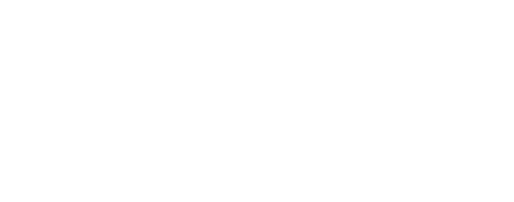

<div align="center">
  
</div>

# G.L.O.W. (Geometric Light Oscillation Workstation)

[](https://www.gnu.org/licenses/gpl-3.0)


[](https://standardjs.com)

An algorithmic visual playground for sound-reactive geometry. 

**Live Demo**: [glow.luminode.studio](https://glow.luminode.studio/)  
**Demos & Showcase**: [YouTube Playlist](https://www.youtube.com/playlist?list=PLPLNsAMGizPvOxgBN0TJDBIRIPvcY6njN)

## What is a Luminode?

A **luminode** is a visual pattern module. Think of it as an oscillator in a synthesizer. The core drawing component that generates geometric shapes and patterns. Each luminode is a self-contained visual effect that responds to MIDI input, creating structured geometries inspired by early computer artists such as Vera Molnár, John Whitney, and kinetic artists like Gego and Soto.

## Features

- **Luminodes** - Modular visual pattern system with 20+ geometric patterns (Lissajous curves, spheres, grids, and more)
- **Luminode Lab** - In-app editor to open built-in sources, live-preview changes, fork/create your own luminodes, and keep them in the browser (localStorage). Open via the flask icon (bottom right, before Help) or from the luminode picker
- **Rendering Pipeline** - Multi-stage visual processing with post-processing effects ([see diagram](diagrams/04-rendering-pipeline.md))
- **Track-Based System** - Multi-track luminode management with independent instances
- **Trajectory Motion System** - Whitney-style motion patterns for spatial animation ([see docs](diagrams/03-track-system.md))
- **Modulation System** - LFO-style parameter modulation for dynamic visual evolution
- **Canvas Filters** - Lumia blur, invert, grid overlay, CRT effect, noise overlay, dither, chromatic aberration
- **Shader backgrounds** - Fluid simulation (GPU-io) plus modular WebGL2 full-screen shaders under `src/shaders/background/` (many adapted from [Shadertoy](https://www.shadertoy.com/) community sketches; you can add modes dynamically — see `src/shaders/background/README.md`)
- **MIDI Mappings** - Custom hardware controller mappings (see `midi-mappings/`)
- **Generate Mode** - Browser-side note generator for testing without a MIDI device (External tab)
- **Tablet Support** - Experimental / in development (Web HID drawing tablet input)
- **PWA / file associations** - Installable app (Chromium). After install, `.glow` / `.set.glow` open as scenes and `.luminode` opens Luminode Lab via the OS File Handling API (complements drag-drop and the in-app picker)

## Quick Start

```bash
npm run start
```

Open `http://localhost:8000/` in Chrome, then:

1. **Click Start** to initialize the app (and request MIDI access).
2. **Open the side panel** (cube icon, top right) and assign a luminode to one or more tracks.
3. Feed notes in one of two ways:
   - **MIDI device** — connect a keyboard / controller (or a virtual port + `node midi-test.js`), assign the device to a track, and play.
   - **Generate mode** — open the **External** tab → **Add Generator**, pick a track, and enable it. Notes are injected per track (no hardware required). Up to four generators (one per track). Disable/remove a generator when you want real MIDI on that track again.
4. Optionally enable **MIDI Output** under Generate Mode if you want to record the random stream elsewhere (it is not meant to be musical).
5. **Hack it** — open **Luminode Lab** (flask icon, bottom right) to edit or invent luminodes with live preview; save them locally and assign them from the picker like any built-in.

See the **[User Manual](USER_MANUAL.md)** for the full walkthrough.

## Documentation

- **[User Manual](USER_MANUAL.md)** - Complete guide to using G.L.O.W.
- **[Architecture Diagrams](diagrams/README.md)** - System architecture and component interactions
- **[Zen of G.L.O.W.](ZEN_OF_GLOW.md)** - Design principles and philosophy

## Browser Requirements

- Modern browser with ES6 module support
- Web MIDI API support (for MIDI input/output)
- Web HID API support (for tablet functionality on macOS/Linux)
- Canvas 2D context support
- File API support (for scene saving/loading)
- For install + “Open with GLOW”: Chromium-based browser over HTTPS (or `localhost`), with service worker and File Handling API support

## Acknowledgements

- **[gpu-io](https://github.com/amandaghassaei/gpu-io)** - Shader examples used for background composition
- **[Shadertoy](https://www.shadertoy.com/)** - Community GLSL ports used as full-screen canvas backgrounds (see `src/shaders/background/README.md` for how to register new ones and for per-shader attribution where applicable)
- **[grained.js](https://github.com/sarathsaleem/grained)** - Noise texture library

Thanks for the code and inspiration.

## License

GPL-3.0
