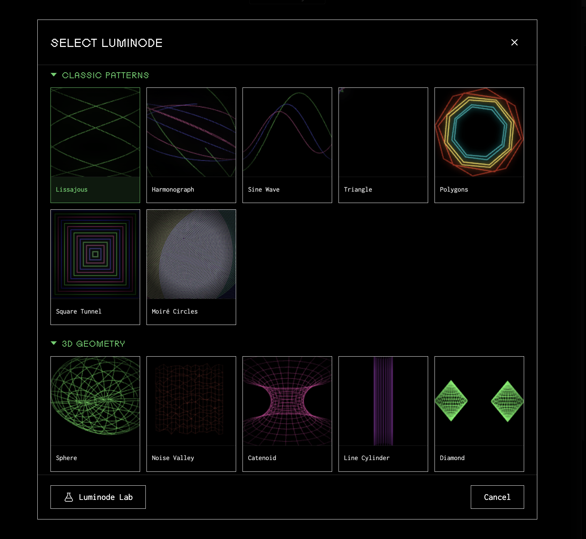
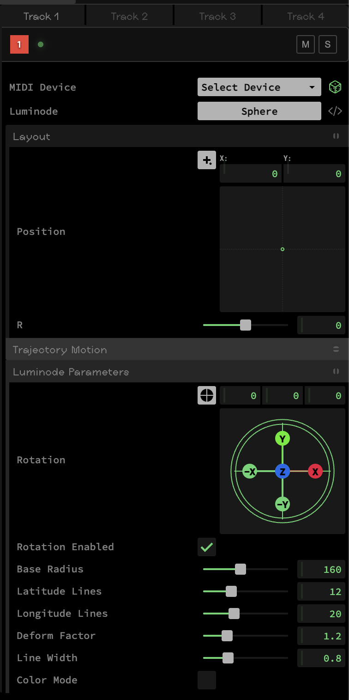
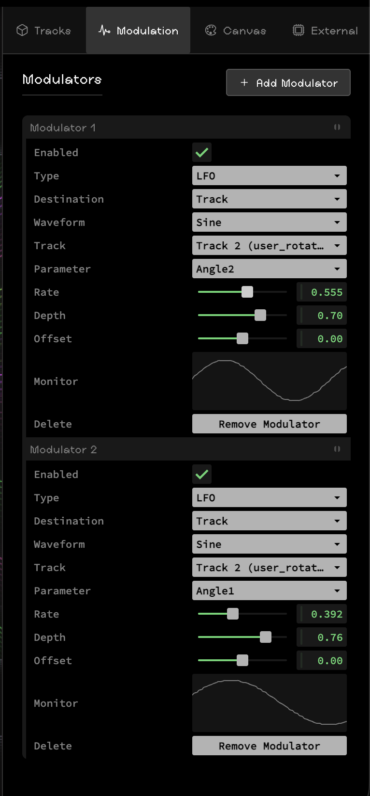

# G.L.O.W.

### A generative visual instrument for composing light with geometry.

[](https://www.gnu.org/licenses/gpl-3.0)


[▶ Open G.L.O.W.](https://glow.luminode.studio/) · [YouTube demos](https://www.youtube.com/playlist?list=PLPLNsAMGizPvOxgBN0TJDBIRIPvcY6njN)

<p align="center">
  
</p>

G.L.O.W. is an open-source visual instrument for creating evolving geometric compositions in real time.

Build scenes from **Luminodes**, small generative drawing systems, and make them move, oscillate, rotate and respond to sound, MIDI or internal generators.

---

## What is G.L.O.W.?

G.L.O.W. explores the relationship between **geometry, motion, modulation and sound**.

Instead of fixed images or animations, it generates visual structures from mathematical systems. Each system can be transformed, animated and modulated into an evolving composition.

The basic building block is the **Luminode**: a small generative drawing module (oscillating lines, harmonic curves, grids, particles, knots, and more). Luminodes combine into tracks, move through trajectories, and respond continuously to modulators.

---

## Start playing

G.L.O.W. runs in the browser. You don't need MIDI or other hardware, built-in generators and modulators produce motion on their own.

Interact with:

- Mouse and keyboard
- Internal generators and modulators
- MIDI controllers / MIDI from other software
- Live audio or audio files as modulation sources

**[▶ Open G.L.O.W.](https://glow.luminode.studio/)** — pick a Luminode, add it to a track, change parameters, and start modulating.

For the full walkthrough see the **[User Manual](USER_MANUAL.md)**.

### Local development

```bash
npm run start
```

1. Open `http://localhost:8000/` in Chrome
2. Click **Start**
3. Open the side panel and assign a luminode to a track
4. Feed notes via MIDI or **Generate mode** (External tab)

### Offline / Raspberry Pi kiosk

```bash
npm run build
npm run serve:dist   # http://127.0.0.1:8080
```

For Chromium kiosk on a Pi (git pull on boot, fullscreen, MIDI/HID permissions), see **[KIOSK.md](KIOSK.md)**.

Example scenes live in [`examples/scenes/`](examples/scenes/). MIDI CC reference mapping: [`midi-mappings/example-mapping.json`](midi-mappings/example-mapping.json).

---

## Luminodes

Luminodes are the fundamental visual systems of G.L.O.W. Each one describes a mathematical process that produces geometry over time.

<p align="center">
  
</p>

Examples include Lissajous figures, harmonographs, moiré patterns, grids, phyllotaxis, curves and oscillators, knots and surfaces, particle systems, plus experimental and user-created systems.

A simple system can become something else entirely when its parameters, trajectories or modulation change.

**Luminode Lab** (flask icon) lets you open built-in sources, live-preview edits, and fork/create luminodes stored in the browser. Details: [User Manual → Luminode Lab](USER_MANUAL.md#luminode-lab).

---

## Compose

G.L.O.W. uses multiple tracks to build compositions. Each track holds a Luminode that can be transformed and modulated independently.

<p align="center">
  
</p>

Layer systems, change scale and position, and let their interactions produce new structures. Spatial motion uses Whitney-style trajectories — see [Track System](diagrams/03-track-system.md).

---

## Effects & render stack

Open the **Mixer** (layers icon) to compose what you see.

**Luminode mixer** — per-track draw order, opacity, blend mode (`difference`, `screen`, …), mute/solo. Tracks are composited onto the main canvas in layer order.

**Effect chain** — drag nodes to reorder the post stack around the locked Luminodes anchor (shader background, chromatic aberration, glass/rain, noise, dither, CRT). Order maps to z-index of those layers.

Mixer track fields (`opacity`, `blendMode`, `layerOrder`) and `canvas.effectLayerOrder` are saved in the `.glow` scene. CSS color filters on the Canvas tab stay separate and are not part of the reorderable chain.

---

## Modulate

Almost any numerical parameter can become a source of movement: position, scale, rotation, line width, canvas filters, shader overlays, and other luminode properties.

<p align="center">
  
</p>

**Sources:**

- **LFO** — classic oscillators (sine, square, triangle, sawtooth, cubic bezier)
- **MIDI** — number of notes / velocity
- **Audio** — live input (mic / interface) or an audio file, analyzed via FFT (RMS, peak, bass/mid/treble, custom bands)

Audio files play through a built-in player (with loop). Multiple modulators can share the same file track. Audio settings and embedded files are saved in the project `.glow` file.

Full controls and destinations: [User Manual → Modulation](USER_MANUAL.md#modulation-system).

---

## Documentation

- **[User Manual](USER_MANUAL.md)** — how to use G.L.O.W.
- **[Architecture Diagrams](diagrams/README.md)** — system overview
- **[Zen of G.L.O.W.](ZEN_OF_GLOW.md)** — design principles

---

## Acknowledgements

- **[gpu-io](https://github.com/amandaghassaei/gpu-io)** — shader examples for background composition
- **[Shadertoy](https://www.shadertoy.com/)** — community GLSL ports (see `src/shaders/background/README.md` for attribution)
- **[grained.js](https://github.com/sarathsaleem/grained)** — noise texture library

## License

GPL-3.0
