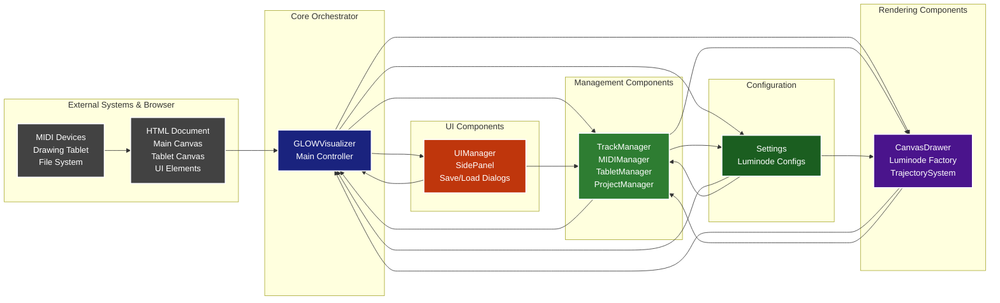

# GLOW System Architecture

This diagram shows the high-level architecture of the GLOW visualizer system, including the main components and their relationships.

## Key Responsibilities

### GLOWVisualizer (Core Orchestrator)
- **Primary Role**: Central coordinator that manages all system components
- **Responsibilities**:
  - Initializes and coordinates all managers
  - Manages the animation loop
  - Handles event routing between components
  - Manages track-based luminode instances
  - Controls application lifecycle (start/stop)

### Management Layer
- **TrackManager**: Manages tracks, luminode assignments, and trajectory configurations
- **MIDIManager**: Handles MIDI input/output, device management, and note processing
- **TabletManager**: Controls drawing tablet input and geometric shape detection
- **ProjectManager**: Handles project saving/loading with complete state preservation

### UI Layer
- **UIManager**: Manages UI controls and triggers application events
- **SidePanel**: Provides settings interface for tracks, tablet, and canvas configuration
- **Dialogs**: Handle project save/load operations with user interaction

### Rendering Layer
- **CanvasDrawer**: Provides low-level canvas operations and layout transformations
- **Luminode Factory**: Creates luminode instances based on track assignments
- **Luminode Instances**: Track-specific drawing modules that render geometric patterns

### Configuration
- **Settings**: Global configuration constants and parameters
- **TrajectorySystem**: Manages motion paths and animations for track layouts
