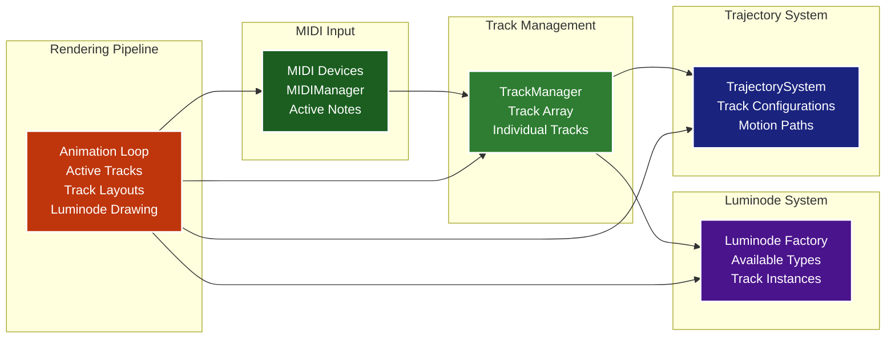

# GLOW Track System Architecture

This diagram shows how the track-based system works, including luminode assignment, MIDI routing, and rendering.

## Track System Features

### 1. Track Structure
Each track contains:
- **Identity**: Unique ID (1-4) and customizable name
- **State**: Mute/solo flags for track control
- **MIDI Assignment**: Connected MIDI device for input
- **Luminode Assignment**: Visual pattern type to render
- **Layout**: Position (x, y) and rotation for spatial arrangement

### 2. Luminode Management
- **Factory Pattern**: Creates luminode instances based on track assignments
- **Track-Specific Instances**: Each track gets its own luminode instance
- **Multiple Instances**: Same luminode type can be used on multiple tracks
- **Dynamic Assignment**: Luminodes can be changed at runtime

### 3. MIDI Routing
- **Device-to-Track Mapping**: MIDI devices are assigned to specific tracks
- **Note Processing**: MIDI notes are routed to the correct luminode type
- **Active Note Tracking**: Real-time tracking of which notes are playing
- **Velocity and Timing**: Full MIDI data preservation for visual effects

### 4. Rendering Pipeline
- **Active Track Filtering**: Only non-muted tracks (or solo tracks) are rendered
- **Layout Calculation**: Each track's position is calculated with trajectory motion
- **Luminode Drawing**: Each active track's luminode draws with its assigned notes
- **Spatial Independence**: Tracks can have different positions and rotations

### 5. Trajectory System
- **Motion Paths**: Tracks can follow predefined or custom motion patterns
- **Real-time Animation**: Smooth movement based on time and configuration
- **Track-Specific**: Each track can have its own trajectory configuration
- **Layout Integration**: Trajectory motion is applied to track layouts