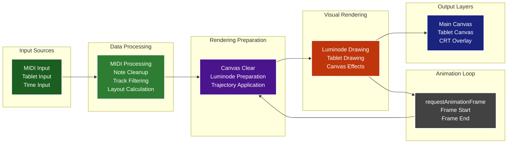
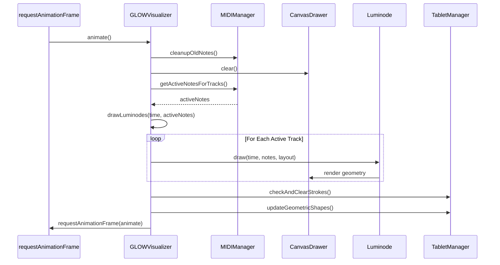

# GLOW Rendering Pipeline

This diagram shows the complete rendering pipeline from MIDI input to visual output.

## Rendering Pipeline Details

### 1. Input Processing
- **MIDI Input**: Real-time note events with velocity and timing
- **Tablet Input**: Drawing tablet strokes and geometric shapes
- **Time Input**: Animation clock for smooth motion and effects

### 2. Data Processing
- **MIDI Processing**: Convert raw MIDI to note objects with timing
- **Note Cleanup**: Remove expired notes based on age and velocity
- **Track Filtering**: Determine which tracks are active (not muted, or solo)
- **Layout Calculation**: Calculate track positions with trajectory motion

### 3. Rendering Preparation
- **Canvas Clear**: Clear canvas with fade effect for smooth transitions
- **Luminode Preparation**: Get luminode instances and their assigned notes
- **Trajectory Application**: Apply motion paths to track layouts

### 4. Visual Rendering
- **Luminode Drawing**: Each active track's luminode draws its pattern
- **Tablet Drawing**: Render user-drawn strokes and geometric shapes
- **Canvas Effects**: Apply CRT overlay, lumia effects, and other visual filters

### 5. Output Layers
- **Main Canvas**: Primary output for luminode patterns
- **Tablet Canvas**: Overlay for drawing tablet input
- **CRT Overlay**: Visual effects layer for retro aesthetics

## Animation Loop Flow

## Performance Considerations

### Frame Rate Optimization
- **60 FPS Target**: Uses `requestAnimationFrame` for smooth animation
- **Selective Rendering**: Only active tracks are processed
- **Efficient Cleanup**: Old notes are removed to prevent memory leaks

### Memory Management
- **Note Cleanup**: Automatic removal of expired MIDI notes
- **Instance Reuse**: Luminode instances are reused for track assignments
- **Canvas Optimization**: Efficient canvas operations with minimal redraws

### Visual Quality
- **Smooth Transitions**: Fade effects for seamless visual flow
- **High Resolution**: Canvas operations support high-DPI displays
- **Effect Layering**: Multiple visual effects can be combined
