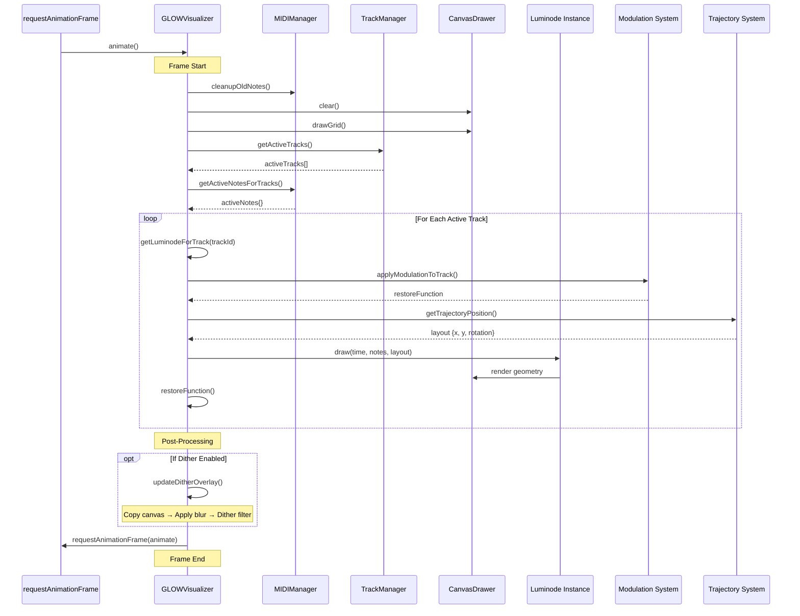

# GLOW Rendering Pipeline

This diagram shows the complete rendering pipeline from MIDI input to visual output with all post-processing effects.

```mermaid
graph LR
    subgraph "Input Processing"
        MIDI[MIDI Devices]
        MIDIMGR[MIDI Manager]
        TRACKMGR[Track Manager]
    end
    
    subgraph Factory
        FACTORY[Luminode Factory]
        LUMINST[Instances<br/>trackId→Luminode]
    end
    
    subgraph "Animation Loop"
        CLEAR[Clear]
        GRID[Grid]
        DRAW[Draw]
        MOD[Modulation]
        TRAJ[Trajectory]
        LUMINODE[Luminode.draw]
    end
    
    subgraph "Canvas & Effects"
        MAIN[Main Canvas]
        GAUSSIAN[Gaussian Blur]
        DITHER[Dither<br/>Copy+Blur+Filter]
        NOISE[Noise]
        CRT[CRT]
    end
    
    OUTPUT[Live Output]
    
    MIDI --> MIDIMGR
    MIDIMGR --> TRACKMGR
    TRACKMGR --> FACTORY
    FACTORY --> LUMINST
    CLEAR --> GRID
    GRID --> DRAW
    DRAW --> MOD
    MOD --> TRAJ
    TRAJ --> LUMINODE
    LUMINODE --> MAIN
    MAIN --> GAUSSIAN
    GAUSSIAN --> DITHER
    DITHER --> NOISE
    NOISE --> CRT
    CRT --> OUTPUT
    
    TRACKMGR -.->|notes| DRAW
    LUMINST -.->|instance| DRAW
    DRAW -.->|RAF| CLEAR
    
    classDef input fill:#2e7d32,stroke:#fff,stroke-width:2px,color:#fff
    classDef factory fill:#4a148c,stroke:#fff,stroke-width:2px,color:#fff
    classDef animation fill:#bf360c,stroke:#fff,stroke-width:2px,color:#fff
    classDef canvas fill:#1a237e,stroke:#fff,stroke-width:2px,color:#fff
    classDef postprocess fill:#e65100,stroke:#fff,stroke-width:2px,color:#fff
    classDef output fill:#424242,stroke:#fff,stroke-width:2px,color:#fff
    
    class MIDI,MIDIMGR,TRACKMGR input
    class FACTORY,LUMINST factory
    class CLEAR,GRID,DRAW,MOD,TRAJ,LUMINODE animation
    class MAIN,GAUSSIAN canvas
    class DITHER,NOISE,CRT postprocess
    class OUTPUT output
```

## Animation Loop Sequence

```mermaid
sequenceDiagram
    participant RAF as requestAnimationFrame
    participant GLOW as GLOWVisualizer
    participant MIDI as MIDIManager
    participant TRACK as TrackManager
    participant CANVAS as CanvasDrawer
    participant LUMINODE as Luminode Instance
    participant MOD as Modulation System
    participant TRAJ as Trajectory System
    
    RAF->>GLOW: animate()
    
    Note over GLOW: Frame Start
    
    GLOW->>MIDI: cleanupOldNotes()
    GLOW->>CANVAS: clear()
    GLOW->>CANVAS: drawGrid()
    
    GLOW->>TRACK: getActiveTracks()
    TRACK-->>GLOW: activeTracks[]
    
    GLOW->>MIDI: getActiveNotesForTracks()
    MIDI-->>GLOW: activeNotes{}
    
    loop For Each Active Track
        GLOW->>GLOW: getLuminodeForTrack(trackId)
        GLOW->>MOD: applyModulationToTrack()
        MOD-->>GLOW: restoreFunction
        
        GLOW->>TRAJ: getTrajectoryPosition()
        TRAJ-->>GLOW: layout {x, y, rotation}
        
        GLOW->>LUMINODE: draw(time, notes, layout)
        LUMINODE->>CANVAS: render geometry
        
        GLOW->>GLOW: restoreFunction()
    end
    
    Note over GLOW: Post-Processing
    
    opt If Dither Enabled
        GLOW->>GLOW: updateDitherOverlay()
        Note over GLOW: Copy canvas → Apply blur → Dither filter
    end
    
    GLOW->>RAF: requestAnimationFrame(animate)
    
    Note over GLOW: Frame End
```
