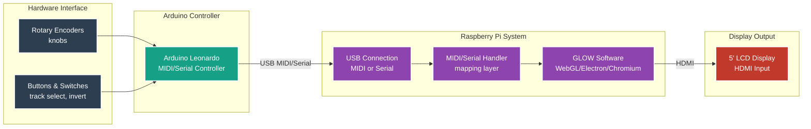

# GLOW Hardware Controller

This document describes the goals, architecture, and development plan for creating a dedicated hardware device that runs **GLOW** as a standalone visual instrument.


---

## 1. Goal

Build a **self-contained visual instrument**, similar in spirit to the Organelle, OXI One, or Squarp devices, running GLOW on embedded hardware (e.g., Raspberry Pi) with:

* A **physical control surface** with fixed mappings.
* **MIDI → GLOW** mapping layer (GLOW acts as a MIDI-controlled engine).
* **Kiosk-mode boot** into GLOW (Electron or Chromium).
* **HDMI video output** for screens and projectors.
* **Project storage (SD Card)** (Save/Load).
* **LFO, Motion/Layout and FX slots**: The device should be a hands-on hardware synthesizer 
* **LCD Screen on the device**: Preview 5inch screen to use the device as standalone compositional tool

The hardware behaves essentially as a **MIDI controller + embedded visual engine**.

---

## 2. System Overview

### Hardware

* Raspberry Pi 4 or later.
* 5 inch LCD Screen
* Custom controller with Arduino Leonardo / Teensy: buttons, encoders, LEDs.
* Prototype: *any* MIDI controller mapped to GLOW.

### Software Stack

1. **Linux-based kiosk system**

   * Autostarts GLOW UI in fullscreen (Electron app or Chromium).
   * Optional ALSA/JACK MIDI.

2. **GLOW Engine Enhancements**

   * “Hardware mode” toggle.
   * Declarative mapping schema.
   * Exposed parameters for:

     * Tracks / Luminode Type
     * Layout / Motion
     * Per-Track Luminode Controls (A–F)
     * LFO1 & LFO2
     * FX Chain
     * Save / Load / Settings

3. **MIDI Mapping Layer**

   * JSON mapping file.
   * Example:

     ```json
     { "cc": 21, "param": "track[1].layout.xPos" }
     ```

### Architecture Diagram



---

## 3. Control Layout (Reference)

```
┌──────────────────────────────────────────────────────────────────┐
│ TRACKS                         LUMINODE SELECT                   │
│ [1] [2] [3] [4]               Enc LuminodeType ◄──────►          │
├──────────────────────────────────────────────────────────────────┤
│ LAYOUT SECTION (fixed)                                           │
│ Enc X-Pos      Enc Y-Pos      Enc Rotation                       │
├──────────────────────────────────────────────────────────────────┤
│ MOTION SECTION (fixed)                                           │
│ Enc Algorithm   Enc Rate      Enc Amplitude                      │
│ Enc Ratio1      Enc Ratio2    [Invert] (button)                  │
├──────────────────────────────────────────────────────────────────┤
│ LUMINODE CONTROL PANEL (per track)                               │
│ Enc A   Enc B   Enc C   Enc D   Enc E   Enc F                    │
├──────────────────────────────────────────────────────────────────┤
│ LFO SECTION (per track)                                          │
│ LFO1: Enc Rate • Enc Depth • WaveBtn • DestBtn                   │
│ LFO2: Enc Rate • Enc Depth • WaveBtn • DestBtn                   │
├──────────────────────────────────────────────────────────────────┤
│ FX CHAIN (2 slots)                                               │
│ FX1: Enc Select • Enc Param • [ON/OFF]                           │
│ FX2: Enc Select • Enc Param • [ON/OFF]                           │
│ (CRT / BLUR / DITHER / NOISE)                                    │
├──────────────────────────────────────────────────────────────────┤
│ SAVE ●    LOAD ●    SETTINGS (hold → system/project menu)        │
└──────────────────────────────────────────────────────────────────┘
```

---


## 4. Possible list of components

   * 4 track buttons
   * 1 Luminode Type encoder
   * 3 Layout encoders
   * 5 Motion encoders + one button
   * 6 Luminode encoders
   * 2×(2 enc + 2 btn) LFO sections
   * 2×FX encoders + ON/OFF buttons
   * Save/Load/Settings buttons
3. Build a **custom USB-MIDI firmware** using:
   * Arduino Leonardo
   * Teensy (optional)

## 5. Notes

* All hardware mappings must remain **deterministic and fixed** to avoid complexity.
* The engine should behave identically whether controlled via hardware or standard MIDI.
* All controls must be **declarative**, readable, and editable.